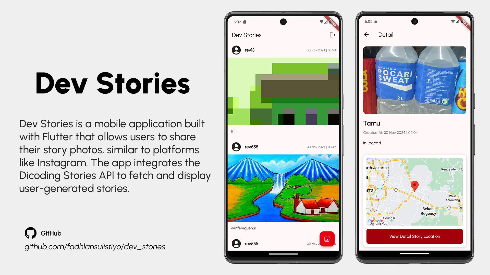
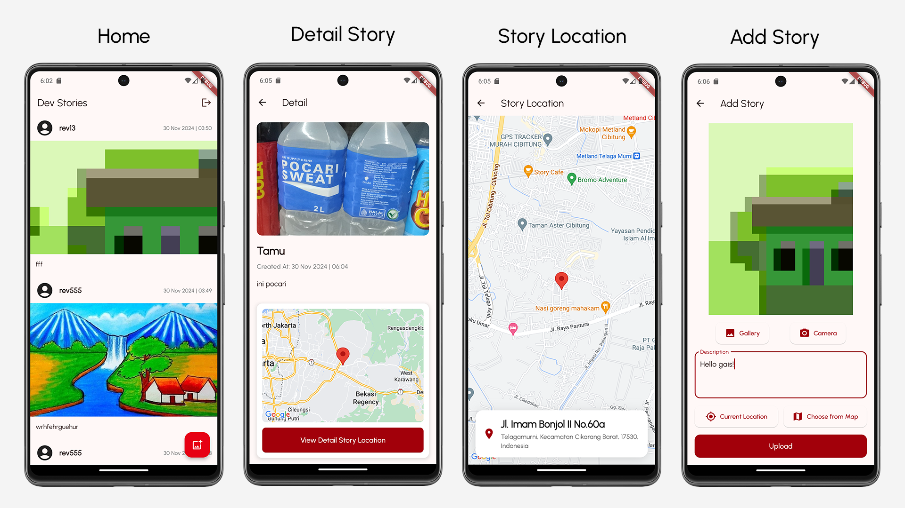
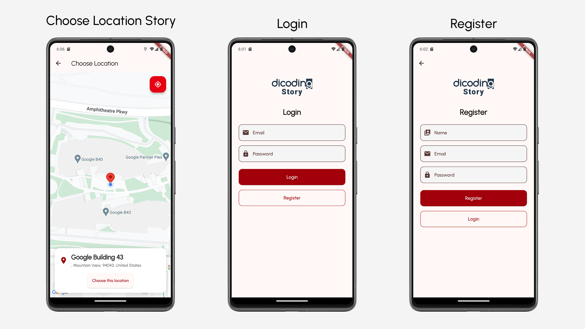

# Dev Stories

Dev Stories is a mobile application built with Flutter that allows users to share their story photos, similar to platforms like Instagram. The app integrates the Dicoding Stories API to fetch and display user-generated stories, offering a simple and engaging experience for sharing and viewing stories.

## Features

- **Declarative Navigation (Navigator 2.0)**: Utilizes Flutter's modern navigation system for more flexible and maintainable routing.
- **Media Picker**: Users can capture photos using the camera or select images from their device's gallery to share their stories.
- **Infinite Scrolling**: Infinite scrolling allows users to effortlessly browse through an endless feed of stories.
- **Code Generation**: Uses code generation for JSON serialization and union types to simplify data parsing and handling.
- **Google Maps API Integration**: Embeds maps and location-based services in the app.

## Tech Stack

- **Flutter**: Cross-platform mobile framework for building natively compiled applications for iOS, Android, web, and desktop from a single codebase.
- **Navigator 2.0**: Advanced navigation model for handling complex routing logic.
- **Dart**: Programming language used for Flutter development.
- **Dicoding Stories API**: The API that provides data for stories shared by users.
- **Google Maps API**: Embeds maps and location-based services in the app.
- **http**: For making network requests to fetch data from the Dicoding Stories API.
- **provider**: State management solution for managing app state, including user authentication and story data.
- **shared_preferences**: A simple storage solution to persist user login state across app sessions.

## Build Setup

This project uses the following build tools and dependencies:

- **Android Build Version**: `com.android.application` version `8.3.2`
- **Gradle**: Version `8.4`
- **Android Studio**: Ladybug (Version `2024.2.1`)

### Code Generation

This project uses code generation for JSON serialization and union types. To regenerate the necessary files, run the following command in your terminal:

`flutter pub run build_runner build`

## API Integration

The app fetches story data using the [Dicoding Stories API](https://story-api.dicoding.dev/v1/), which provides access to the stories shared by users. Ensure that you have a valid API key and configure it in the app's environment before using the app.

## Screenshots

